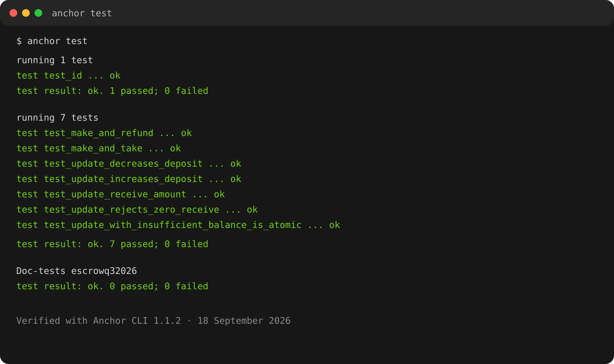

# Turbine — Week 2 Assignment: Vault and Escrow

This repository contains the Anchor implementation of the escrow part of the Turbine Week 2 assignment. The program allows a maker to publish a token exchange offer and lets a taker accept it atomically without a trusted intermediary.

## Assignment coverage

| Requirement | Status | Notes |
| --- | --- | --- |
| Vault program with `withdraw` and `close` | Not included in this repository | There is currently no `programs/vault` package. |
| Escrow instructions: `make`, `take`, `refund`, `update` | Complete | Implemented in `programs/escrowq32026`. |
| Tests using Rust and LiteSVM | Complete | Seven integration tests cover the escrow flows. |
| Timed escrow extension | Complete | `take` is rejected after the stored expiration timestamp. |
| Non-custodial vault extension | Not implemented | Optional advanced challenge. |

## Escrow model

The escrow exchanges two SPL tokens:

- **Mint A** is offered by the maker.
- **Mint B** is requested from the taker.

When the maker creates an offer, Mint A is transferred into a vault associated token account owned by the escrow PDA. The taker can then complete the exchange in one transaction:

```text
Maker ATA A ── make ──> Escrow vault A

Taker ATA B ── take ──> Maker ATA B
Escrow vault A ── take ──> Taker ATA A
```

The escrow account is derived with:

```text
[b"escrow", maker_pubkey, seed.to_le_bytes()]
```

The account stores the maker, both mint addresses, the amount of Mint B requested, the PDA bump, and the expiration timestamp. The seed and account constraints are shared through [`constants.rs`](programs/escrowq32026/src/constants.rs), while program errors are defined in [`error.rs`](programs/escrowq32026/src/error.rs).

## Instructions

### `make`

Creates the escrow PDA and its Mint A vault, then deposits the requested amount of Mint A from the maker's associated token account.

Arguments:

- `seed`: unique maker-controlled value used in the PDA derivation;
- `deposit`: amount of Mint A placed in the vault;
- `receive`: amount of Mint B requested from the taker;
- `expiration`: Unix timestamp after which the offer cannot be taken.

`receive` must be greater than zero.

Implementation: [`make.rs`](programs/escrowq32026/src/instructions/make.rs).

### `take`

Checks that the offer has not expired, then performs the exchange:

1. transfers `escrow.receive` units of Mint B from the taker to the maker;
2. transfers the full Mint A vault balance from the escrow PDA to the taker;
3. closes the vault and escrow accounts.

The PDA signs the vault transfer and close CPI with the seeds stored in the escrow account.

Implementation: [`take.rs`](programs/escrowq32026/src/instructions/take.rs).

### `refund`

Allows the maker to recover the Mint A balance from the vault. The escrow PDA signs the transfer back to the maker, then the vault and escrow accounts are closed.

Implementation: [`refund.rs`](programs/escrowq32026/src/instructions/refund.rs).

### `update`

Allows the maker to update an open offer:

- `receive` can be changed as long as it remains greater than zero;
- reducing `deposit` returns the difference from the vault to the maker;
- increasing `deposit` transfers the difference from the maker to the vault.

The token balance of the vault is used as the source of truth for the current deposit. An update cannot be made after `take` or `refund` because those instructions close the escrow and vault accounts.

Implementation: [`update.rs`](programs/escrowq32026/src/instructions/update.rs).

## Timed escrow extension

The optional timed mechanism is implemented with Solana's Clock sysvar. During `take`, the program requires:

```text
current_unix_timestamp <= escrow.expiration
```

If the deadline has passed, the taker cannot accept the offer and receives the `EscrowExpired` error. The maker can still use `refund` to recover the deposit.

## Tests

Tests are written in Rust and run with LiteSVM. They create mints, associated token accounts, PDAs, and transactions directly in the test process.

The test suite covers:

- `test_make_and_refund`: deposits Mint A, refunds it, and verifies account closure;
- `test_make_and_take`: completes the swap, checks all token balances, verifies account closure, and rejects an update after taking;
- `test_update_receive_amount`: changes the requested Mint B amount;
- `test_update_decreases_deposit`: returns excess Mint A to the maker;
- `test_update_increases_deposit`: deposits additional Mint A and updates the requested amount;
- `test_update_rejects_zero_receive`: rejects an invalid requested amount without changing state;
- `test_update_with_insufficient_balance_is_atomic`: rejects an underfunded increase without partial state changes.

Test source: [`tests/mod.rs`](programs/escrowq32026/tests/mod.rs).

### Run the tests

Requirements:

- Rust toolchain from [`rust-toolchain.toml`](rust-toolchain.toml);
- Anchor CLI 1.1.x;
- Solana CLI.

From the repository root:

```bash
anchor test
```

The repository sets `skip_local_validator = true` in [`Anchor.toml`](Anchor.toml), and the Rust tests use LiteSVM instead of starting a local validator. Additional useful checks are:

```bash
cargo fmt --all -- --check
cargo clippy -p escrowq32026 --all-targets -- -D warnings
cargo test -p escrowq32026 # after `anchor build`, which creates the test program binary
```

### Test result

The latest verified run contains one passing unit test and seven passing integration tests:



## Architecture diagrams

The repository also contains diagrams for the three main escrow flows:

| Flow | Diagram |
| --- | --- |
| Make | [`arch/make.png`](arch/make.png) |
| Take | [`arch/take.png`](arch/take.png) |
| Refund | [`arch/refund.png`](arch/refund.png) |

## Project structure

```text
programs/escrowq32026/
├── src/
│   ├── instructions/
│   │   ├── make.rs
│   │   ├── take.rs
│   │   ├── refund.rs
│   │   └── update.rs
│   ├── constants.rs
│   ├── error.rs
│   ├── state.rs
│   └── lib.rs
└── tests/mod.rs
```

## Optional work not included

The non-custodial vault challenge is outside the scope of this escrow repository. Implementing it would require a separate vault state model, position accounting, and redemption rules for the underlying market position.
